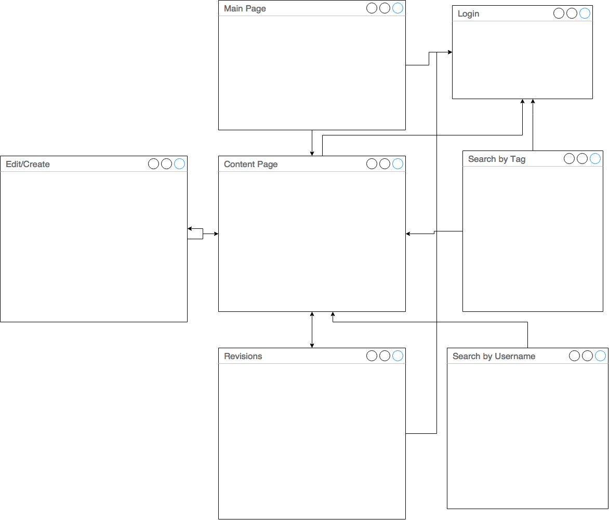
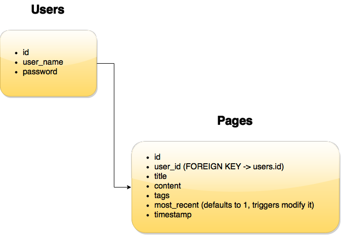

#Ramen Wiki
###User Stories
A user on the Ramen Wiki will have access to full CRUD. They will be able to create any page that doesn't exist, update a page if it does, delete it (OR roll it back to a previous version), as well as view all pages.

Users will be also able to create their own logins which will persist through cookies across the site.

###Wireframe

This is a rough wireframe, and a number of elements in it (namely login and search) may be replaced with modals and a persistant navigation bars. The index page will display a random page link as well as have basic features. Content pages will display content and also allow for editing. Revision pages will show all revisions made on the page. 

###Database ERD

The database consists of two tables, one which persists for users and one for pages.

###Routes

GET routes:
* wiki -> base wiki page
* :content -> Depending on if it exists or not will either bring you to the content or to a create page
* :content/revisions -> view all versions of the page
* login -> login page (or potentially modal)
* search -> search page/results page

POST routes:
* :content -> posts content and redirects to it
* login -> logs user in and creates a cookie

PUT routes:
* :content -> put content and redirects to it

Delete routes:
* wiki -> deletes content from :content

